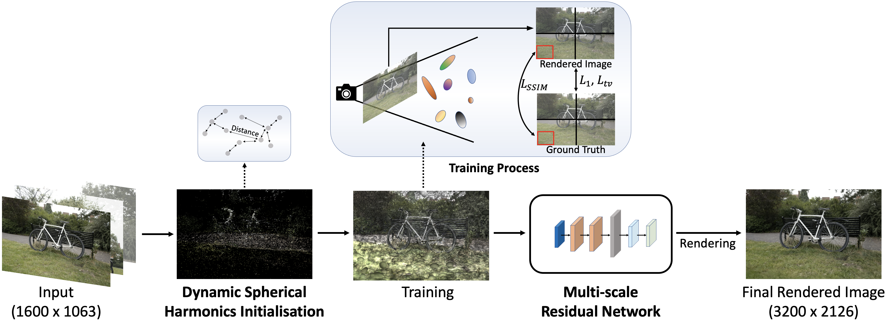
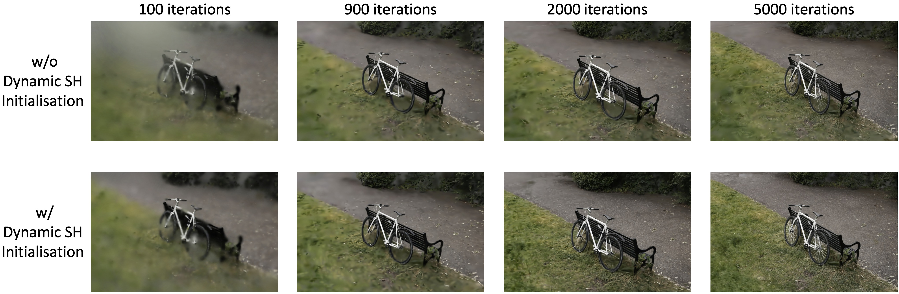

<p align="center">

  <h1 align="center">StructGS: Adaptive Spherical Harmonics and Rendering Enhancements for Superior 3D Gaussian Splatting</h1>
  <p align="center">
    <a href="https://github.com/HZXu-526">Zexu Huang</a>
    ·
    <a href="https://profiles.uts.edu.au/Min.Xu">Min Xu</a>
    ·
    <a href="https://profiles.uts.edu.au/Stuart.Perry">Stuart Perry</a>


  </p>
</p>

<p align="center">
We introduce a Patch-based SSIM, dynamic Adjustment of Spherical Harmonics and a pre-trained Multi-scale Residual Network to 3DGS. 
Our approach achieve high quality renderings compared to SOTA methods.
</p>
<br>

# Overview


# Superiority
There you can see some of our model's results that outperform results from SOTA:

and 


# Installation
Clone the repository and create an anaconda environment using
```
git clone https://github.com/HZXu-526/StructGS.git
cd StructGS

conda create -y -n struct_gs python=3.8
conda activate struct_gs

pip install torch==1.12.1+cu113 torchvision==0.13.1+cu113 -f https://download.pytorch.org/whl/torch_stable.html
conda install cudatoolkit-dev=11.3 -c conda-forge

pip install -r requirements.txt

pip install submodules/diff-gaussian-rasterization
pip install submodules/simple-knn/
```

# Dataset

## Mip-NeRF 360 Dataset
Please download the data from the [Mip-NeRF 360](https://jonbarron.info/mipnerf360/) and request the authors for the treehill and flowers scenes.

## Villa Dataset
Please download the data from [here](https://drive.google.com/drive/folders/11VObGnHivCc9M265CxqjAG2G2SbCH3W2?usp=drive_link).

## Other Public Datasets
Please download the bungeeNeRF, DeepBlending and Tanks&Temples datasets from [Scaffold-GS](https://github.com/city-super/Scaffold-GS) repository.

# Processing your Own Scenes
Please follow the instructions of "Processing your own Scenes"
in [3D Gaussian Splatting](https://github.com/graphdeco-inria/gaussian-splatting).

# Training and Evaluation
We providede python scripts to train and evaluate the above datasets.

```
# mip-nerf 360
python run_mip360.py

# bungeeNeRF
python run_bungnerf.py

# deep blending
python db.py

# tanks&temples
python run_tandt.py
```

or you can run specific scene using:

```
# training
python train.py -s {dataset}/{scene} -m {output_dir}/{scene} --eval

# rendering
python render.py -m {output_dir}/{scene} --data_device cpu --skip_train

# evaluation
python metrics.py -m {output_dir}/{scene}
```

# Online viewer
After training, you can fuse the 3D smoothing filter to the Gaussian parameters with
```
python create_fused_ply.py -m {model_dir}/{scene} --output_ply fused/{scene}_fused.ply
```
Then use Mip-Splatting's [online viewer](https://niujinshuchong.github.io/mip-splatting-demo) to visualize the trained model

or use the SIBR viewer with
```
viewers\bin\SIBR_gaussianViewer_app.exe --model-path {output_dir}\{scene}
```
or use the [SuperSplat](https://playcanvas.com/supersplat/editor) (the easiest one, simply drag the .ply file into the website without fusing the 3D smoothing filter).

# Acknowledgements
This project is built upon [3DGS](https://github.com/graphdeco-inria/gaussian-splatting) and [Mip-Splatting](https://github.com/autonomousvision/mip-splatting). Please follow the license of 3DGS. We thank all the authors for their great work and repos. 

# Citation
If you find our code or paper useful, please cite
```bibtex
```